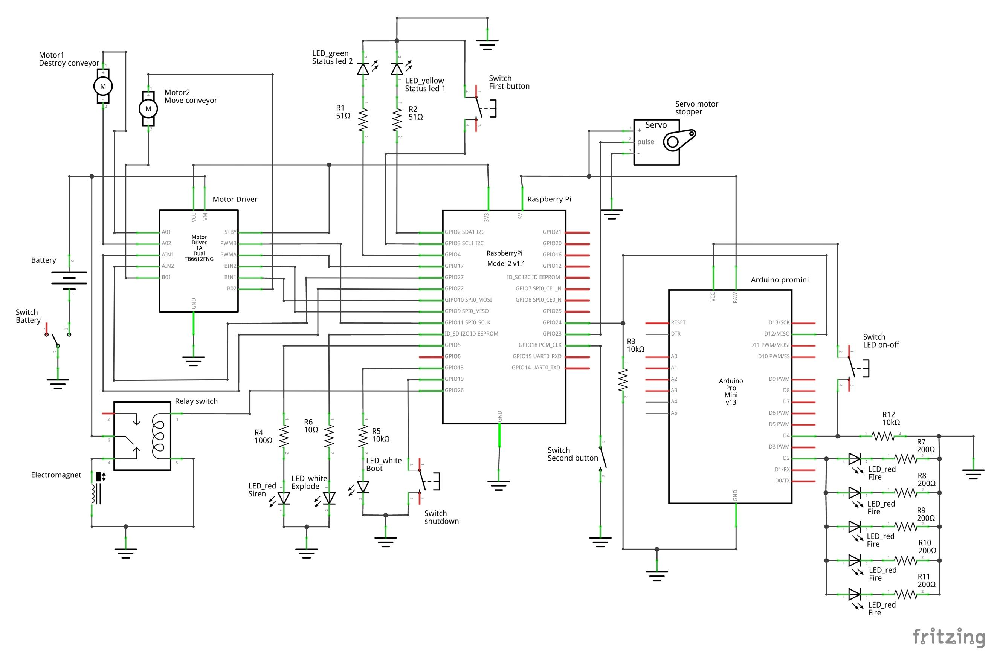

# 機械工作実習2で制作するロボットのためのプログラム

## プログラムの用途
岡山大学機械システム系学科システムコースの機械工作実習2の授業にて制作するロボットに使用するプログラム

## 動作環境
### Raspberry PI
`Raspberry PI 2 model B` を使用する．（無線LANの使用も考えているため，`Raspberry PI 3 model B` も考慮する）

```shell-session:raspbian_version
$ lsb_release -a
No LSB modules are available.
Distributor ID:	Raspbian
Description:	Raspbian GNU/Linux 9.4 (stretch)
Release:	9.4
Codename:	stretch
```
### Python3
```shell-session:pytnon3_version
$ python3 --version
Python 3.5.3
```
## 準備
### ハードウェア
#### PinOut
詳細は [pinout_manual](manuals/pinout_manual.md) を参照すること．

#### 回路図
**下の回路は，設計に問題があり，Raspberry Pi 本体を破壊する恐れがあるため，この設計のままで使用しないこと**



### ソフトウェア
#### スクリプトのダウンロードと追加パッケージのインストール
以下のコードをコピペする．

```bash:install_mp2_a2
mkdir -p $HOME/Git && \
cd $HOME/Git && \
sudo apt install -y python3-pygame python3-gpiozero git && \
git clone https://github.com/sik103/ManufacturingPractice2_A2.git && \
sh ManufacturingPractice2_A2/install.sh
```

#### Arduino
Arduino promini にスケッチをアップロードする．スケッチは [ManufacturingPractice2_A2_ard_sketch_GitHub](https://github.com/sik103/ManufacturingPractice2_A2_ard_sketch) を参照すること．

#### gdriveの設定と音源のダウンロード
著作権等の問題により，GitHubへの音源の保存が難しいと思われるため，音源はGoogle Driveに入れ，テスト環境と本番環境を同期化させる．詳細は [gdrive_manual](manuals/gdrive_manual.md) を参照すること．

### その他のRaspberry PIの設定方法
詳細は [rpi_manual](manuals/rpi_manual.md) を参照すること．

## 動作内容
1. 光（火の元）を開始
1. fire_and_conveyor
    1. スイッチ（センサー1）を押したら
        1. 音，光（サイレン）を開始：**開始時間**，**動作時間**
            - 光：豆電球等で，クレーン車の上に
        1. ベルコン（モータ1）を開始：**開始時間**，**動作時間**
            - モータドライバ
    1. クレーンが倒れる
        1. クレーンを倒す（モータ2）: **開始時間**，**動作時間**
            - 糸を緊張させておいて，モータを若干回転させる
        1. ストッパーを外す（モータ3）: **開始時間**，**動作時間**
            - サーボモータで制御
1. explode_and_escape
    1. センサー（センサー2）でスタート
        1. 音（爆発音）と光（LED2） ：**開始時間**，**動作時間**
        1. ジャンプ（モータ4）：**開始時間**，**動作時間**
            - リレーを介して，ゴムを離す -> ガウス砲
1. 一定時間後に光（火の元）を停止

**太字**: setting_time.json

### 注意事項
- 開始時間はすべて `センサー` を基準にする．（動作部がボールの動きと一致しないため）

## オプション
- `sh start.sh` に使用する．
- 詳細
    - `--finishtime`, `-t`: 動作時間を計測する．
    - `--saveoutput`, `-s`: 標準出力をファイルに記録する．
    - `--waitforenter`, `-e`: Raspberry PI のセンサーの代わりにキーボードの `Enter` キーを使用する．
    - `--no-loop`, `-nl`: スクリプトを一回だけ動作させる．
- 使用例
    - `$ sh start.sh -t -e`: 動作時間を測定し，実行時に出力された標準出力をファイルに記録する．

## その他のマニュアル
- モータドライバについて：[tb6612fng_manual](manuals/tb6612fng_manual.md) を参照すること
- Debug 時などに使えるUbuntuのコマンドなど：[ubuntu_manual](manuals/ubuntu_manual.md)を参照すること

## 参考文献
[Raspberry Piで音楽(wav/mp3)ファイルを再生する方法 python編](https://qiita.com/Nyanpy/items/cb4ea8dc4dc01fe56918)

[google drive を コマンドから使うgdrive が早くて便利](http://takuya-1st.hatenablog.jp/entry/2016/07/06/034412)

[RaspberryPi 3 コマンドで音量を上げる（ラジオをテレビで再生→音量不足→コマンドで音量UP）](http://min117.hatenablog.com/entry/2017/06/22/212425)

## 音源
[効果音ラボ](https://soundeffect-lab.info/)
